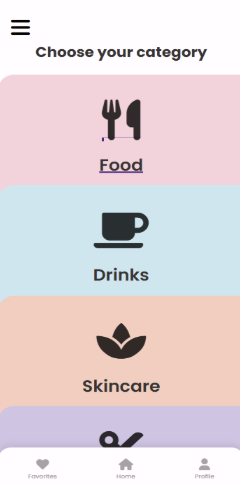

# ClearChoice – Ingredient Checker Web App

## Overview
ClearChoice is a web-based ingredient checking application that helps users make safer product choices by analyzing and categorizing ingredients as Good, Moderate, or Bad.

## Features
- Ingredient scanning or manual ingredient input
- Ingredient safety classification (Good / Moderate / Bad)
- Allergen alerts for sensitive users
- Product categories (Food, Skincare, Daily Products)
- User profile with saved products
- Clean and responsive user interface

## Tech Stack
- HTML
- CSS
- JavaScript

## Screenshots
### Home Page

### Categiroes Page

### Upload Image Page

## How to Run the Project
1. Download or clone the repository
2. Open the project folder
3. Open `index.html` in a web browser

## Future Improvements
- Barcode scanning integration
- Backend database support
- User authentication
- AI-based ingredient analysis

## Author
Saniya Khan  
LinkedIn: https://www.linkedin.com/in/saniya-khan-0591b5273
